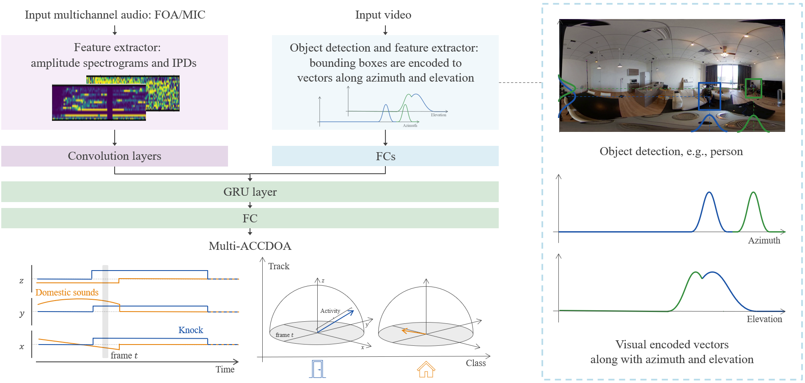

# Audio-Visual Sound Event Localization and Detection
The codebase is benchmark code for audio-visual sound event localization and detection (SELD) in [STARSS23: An Audio-Visual Dataset of Spatial Recordings of Real Scenes with Spatiotemporal Annotations of Sound Events](https://arxiv.org/abs/2306.09126).
Please check the paper of STARSS23 for details missing in this repository.

Also, the codebase is used as baseline code in [DCASE 2023 SELD Task Track B Audio-Visual Inference](https://dcase.community/challenge2023/task-sound-event-localization-and-detection-evaluated-in-real-spatial-sound-scenes).

## Baseline system
The baseline system for the audio-visual SELD task has similar architecture to an audio-only SELD system based on SELDnet [2] and multiple activity-coupled Cartesian direction of arrival (Multi-ACCDOA) [3].

Before the audio-visual SELD system, here is a summary of the audio-only SELD system.
The input is multichannel audio, from which the different acoustic features are extracted based on the input format of the audio.
The audio-only system takes a sequence of consecutive feature-frames and predicts all the active sound event classes for each of the input frame along with their respective spatial location, producing the temporal activity and DOA trajectory for each sound event class.
In particular, a convolutional recurrent neural network (CRNN) is used to map the frame sequence to a Multi-ACCDOA sequence output which encodes both sound event detection (SED) and direction of arrival (DOA) estimates in the continuous 3D space as a multi-output regression task.
The CNN part encodes the audio features to audio embeddings, and then the RNN and fully-connected layers (FCs) decode the embedding sequence to the Multi-ACCDOA sequence.
Each sound event class in the Multi-ACCDOA output is represented by three regressors that estimate the Cartesian coordinates x, y and z axes of the DOA around the microphone.
If the vector length represented by x, y and z coordinates are greater than a threshold, the sound event is considered to be active, and the corresponding x, y, and z values are considered as its predicted DOA.

While the audio-only system takes only the audio input, the baseline system for the audio-visual SELD task takes both the audio and a visual input.
The visual input is a corresponding image at the start frame of the audio feature sequence.
With the corresponding image, an object detection module (e.g., [4]) outputs bounding boxes of potential objects.
These bounding boxes are transformed to a concatenation of two Gaussian-like vectors, where they represent likelihoods of objects present along the image's horizontal axis and vertical axis [5].
The Gaussian-like vectors are encoded to a visual embedding by FCs.
Then the audio embeddings from the audio encoder and the visual embedding are concatenated.
The concatenated feature sequence are fed into the decoder to output a Multi-ACCDOA sequence.

The final audio-visual SELD baseline architecture is as shown below.
<p align="center">
   
</p>

## File structure

```
audio-visual-seld-dcase2023_         This repository.
├── _audio_metadata_all_split_with_prompt.json  metadata file
├── dcase2022_task3_seld_metrics
├── feature
├── image
├── LICENSE
├── mmdetection
├── net
├── npy2csv.py                      generate csv file from npy file.
├── object_detection.py
├── para.py                         generate short video and foa/binaural clips
├── para_resize.py                  resize video
├── __pycache__
├── README.md
├── resample.py                     resample audio to 24kHz
├── resize_video.py
├── script
│   ├── eval_seld.sh                Evaluation script.
│   ├── train_seld_bin.sh           Training script for binaural input.
│   ├── train_seld_foa.sh           Training script for FOA input.
│   ├── train_seld_mic.sh
│   └── train_seld_vit.sh           Training script for vision transformer model.
├── seld_data_loader.py
├── seld_eval_dcase2022.py
├── seld_predictor.py
├── seld.py
├── seld_trainer.py
├── seld_validator.py
├── split.py                        
├── split_train_test.py               split test and train data.
├── util
├── vision_transformer.py              vision transformer model
└── wav_convertor.py
```

### Prerequisites
The provided system has been tested on linux, python 3.8.16, and pytorch 1.7.1.

You can install the requirements by running the following lines.
```
conda create --name audio_visual_seld_dcase2023 python=3.8 -y
conda activate audio_visual_seld_dcase2023
conda install pytorch==1.7.1 torchvision==0.8.2 torchaudio==0.7.2 cudatoolkit=11.0 -c pytorch -y
```

You need to set up mmdetection for object detection model. (Ref: https://github.com/open-mmlab/mmdetection/blob/master/docs/en/get_started.md/)
```
pip install -U openmim
mim install mmcv-full
git clone https://github.com/open-mmlab/mmdetection.git
cd mmdetection
pip install -v -e .
mim install mmdet==2.28.1
mim download mmdet --config yolox_tiny_8x8_300e_coco --dest .
cd ..
```

After installation of mmdetection, you can continue to install with the below lines.
```
conda install tensorboard -y
conda install tqdm -y
conda install -c conda-forge pysoundfile -y
conda install -c conda-forge librosa -y
conda install ipython -y
conda install chardet -y
pip install moviepy==1.0.3
conda install pandas==1.5.3 -y
```

### Training trial
Before training, we need to convert HD mp4 files to low resolution mp4 files (360x180) for reduce of calculation cost.
```
python resize_video.py
```

After the conversion, run the script as shown below.
This will dump the logs and models in the `./data_dcase2023_task3/model_monitor/<DateTime>`.

You may modify the path for python on the script.
CPU memory needs 15GB and GPU memory 2GB.
The training takes around half a dozen hours.
```
bash script/train_seld_foa.sh
```

Microphone array version is the same way.
```
bash script/train_seld_mic.sh
```

The binaural version is the same way.
```
bash script/train_seld_bin.sh
```

The vision transformer version is the same way(with foa or binaural).
```
bash script/train_seld_vit.sh
```

You can check the training details using TensorBoard.

### Evaluation trial

The evaluation script is as shown below.
```
bash script/eval_seld.sh
```